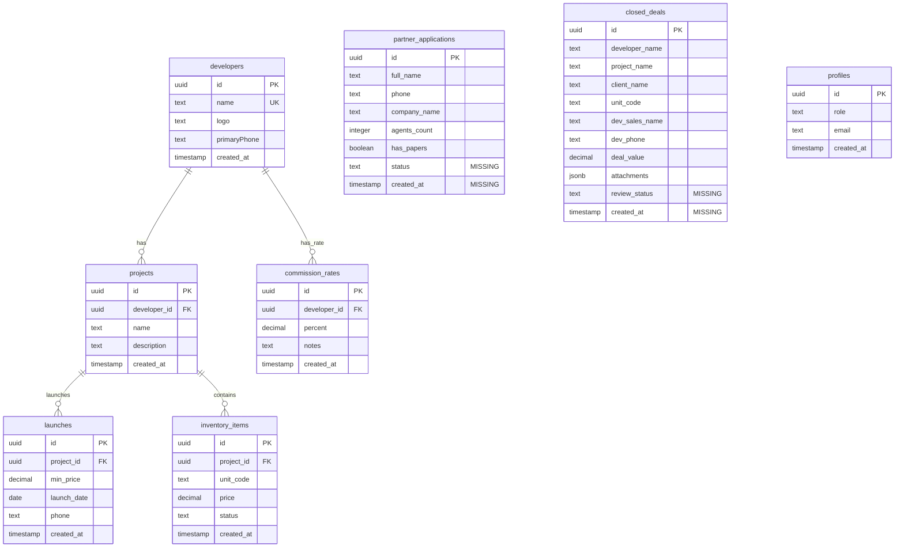

# Architecture Review: Bold Routes Partners

**Review Date:** 2024-12-19  
**Reviewer:** Principal Full-Stack Architect  
**Scope:** End-to-end review of React + Supabase application

## Executive Summary

Bold Routes Partners is a React-based web application with Supabase backend serving real estate partner management. The application handles partner applications, deal submissions with file uploads, and provides an admin interface for data review. This review identifies critical security gaps, performance issues, and operational improvements needed for production readiness.

**Overall Risk Level:** 🔴 HIGH - Critical security vulnerabilities require immediate attention

## Current State Summary

### Frontend Architecture
- **Framework:** React 18 + Vite + TypeScript
- **Routing:** React Router DOM v6
- **State Management:** Zustand (legacy) + React Query (new)
- **Styling:** Tailwind CSS with custom monochrome design system
- **Form Handling:** React Hook Form + Zod validation
- **File Structure:** Feature-based organization with shared components

### API Integration
- **Backend:** Supabase (PostgreSQL + Auth + Storage)
- **Authentication:** Magic link OTP for admin users
- **File Storage:** Private bucket `deal-attachments`
- **Data Fetching:** Direct Supabase client calls (no React Query implementation yet)

### Environment Configuration
```
VITE_SUPABASE_URL=<project_url>
VITE_SUPABASE_ANON_KEY=<anon_key>
```

## Data Model Analysis



## RLS Policy Matrix

| Table | SELECT | INSERT | UPDATE | DELETE | Notes |
|-------|--------|---------|---------|---------|-------|
| **developers** | ✅ anon | ❌ | ❌ | ❌ | Public read-only |
| **projects** | ✅ anon | ❌ | ❌ | ❌ | Public read-only |
| **commission_rates** | ✅ anon | ❌ | ❌ | ❌ | Public read-only |
| **launches** | ✅ anon | ❌ | ❌ | ❌ | Public read-only |
| **inventory_items** | ✅ anon | ❌ | ❌ | ❌ | Public read-only |
| **partner_applications** | 🔴 **MISSING** | ✅ anon | ❌ | ❌ | **CRITICAL: No RLS policies** |
| **closed_deals** | 🔴 **MISSING** | ✅ anon | ❌ | ❌ | **CRITICAL: No RLS policies** |
| **profiles** | 🔴 **MISSING** | 🔴 **MISSING** | 🔴 **MISSING** | ❌ | **CRITICAL: No RLS policies** |

### Storage Policies
| Bucket | SELECT | INSERT | UPDATE | DELETE | Notes |
|--------|--------|---------|---------|---------|-------|
| **deal-attachments** | ✅ admin only | 🔴 **ANY PATH** | ❌ | ❌ | **CRITICAL: No path restrictions** |

## API Inventory

### Public API (`src/api/public.ts`)
| Function | Supabase Operation | Security Risk | Line |
|----------|-------------------|---------------|------|
| `getCommissions()` | `.from("commission_rates").select()` | ✅ Safe | 4-8 |
| `getLaunches()` | `.from("launches").select()` | ✅ Safe | 12-17 |
| `submitApplication()` | `.from("partner_applications").insert()` | 🔴 No validation | 23-25 |
| `uploadDealFile()` | `.storage.from("deal-attachments").upload()` | 🔴 No file validation | 29-32 |
| `submitClosedDeal()` | `.from("closed_deals").insert()` | 🔴 No validation | 40-50 |

### Admin API (`src/api/admin.ts`)
| Function | Supabase Operation | Security Risk | Line |
|----------|-------------------|---------------|------|
| `signInWithEmail()` | `.auth.signInWithOtp()` | ✅ Safe | 3-6 |
| `getSession()` | `.auth.getSession()` | ✅ Safe | 10 |
| `listApplications()` | `.from("partner_applications").select()` | 🔴 No RLS check | 12-15 |
| `listDeals()` | `.from("closed_deals").select()` | 🔴 No RLS check | 17-20 |
| `signUrl()` | `.storage.createSignedUrl()` | 🔴 No admin check | 23-26 |

## Critical Security Gaps

### 🔴 P0 - Critical (Immediate Action Required)

1. **Missing RLS Policies**
   - `partner_applications`, `closed_deals`, `profiles` tables have NO RLS policies
   - Any authenticated user can read/write all data
   - **Impact:** Complete data breach, GDPR violation

2. **Storage Path Injection**
   - File uploads accept any path, not restricted to `deals/` prefix
   - **Impact:** Can overwrite system files, access other buckets

3. **No File Validation**
   - No MIME type restrictions
   - No file size limits (client-side)
   - **Impact:** Malware uploads, storage DoS, XSS via SVG

4. **Admin Role Bypass**
   - Admin check only in frontend, no backend RLS
   - Signed URL generation doesn't verify admin role
   - **Impact:** Data breach via direct API calls

### 🟡 P1 - High (Within 1 week)

5. **Input Validation Gaps**
   - No maximum string lengths (DoS via large payloads)
   - No upper bounds on numeric values (`deal_value` could be infinity)
   - Phone numbers not normalized

6. **No Rate Limiting**
   - Public forms vulnerable to spam/DoS
   - No CAPTCHA or anti-automation

7. **Error Information Disclosure**
   - Database errors exposed to client
   - Detailed Supabase errors in browser

## Performance Issues

### 🟡 P1 - High Impact

1. **No React Query Implementation**
   - Direct Supabase calls with no caching
   - Network requests block UI
   - **Impact:** Poor UX, high Supabase costs

2. **Admin Lists Not Paginated**
   - Loads all records at once
   - **Impact:** Performance degradation with scale

3. **No File Upload Progress**
   - Users don't see upload status
   - Can't cancel/retry failed uploads

### 🟢 P2 - Medium Impact

4. **Bundle Size**
   - All components loaded eagerly
   - No route-based code splitting beyond existing lazy loading

5. **No Loading States**
   - Forms show no feedback during submission
   - Admin lists show no skeleton loading

## Cost Control Risks

1. **Storage Growth**
   - No file retention policies
   - No automatic cleanup of abandoned uploads
   - **Projected Impact:** Linear storage cost growth

2. **Signed URL Generation**
   - No caching of signed URLs
   - Generated on every file access
   - **Impact:** API rate limit exhaustion

3. **Database Query Volume**
   - No caching layer
   - Repetitive read queries for static data
   - **Impact:** High read replica costs

## Compliance & Operational Gaps

1. **No Audit Trail**
   - Admin actions not logged
   - No change tracking for sensitive operations

2. **No Backup Strategy**
   - No automated backups configured
   - No disaster recovery plan

3. **No Monitoring**
   - No error tracking (Sentry)
   - No performance monitoring
   - No uptime monitoring

## Recommendations Summary

### Immediate Actions (P0 - This Week)
1. Implement RLS policies for all user-generated tables
2. Restrict storage uploads to `deals/` path prefix only
3. Add admin role verification for sensitive operations
4. Implement file type and size validation

### Short Term (P1 - Next 2 Weeks)
1. Add React Query with proper caching
2. Implement pagination for admin lists
3. Add input length limits and sanity checks
4. Add rate limiting and CAPTCHA

### Medium Term (P2 - Next Month)
1. Add comprehensive error boundaries
2. Implement audit logging
3. Add monitoring and alerting
4. Optimize bundle size and loading

### Long Term (P3 - Next Quarter)
1. Implement automated backups
2. Add advanced admin features (approve/reject)
3. Add webhook notifications
4. Implement advanced analytics

## Risk Score: 8.5/10 (Critical)

**Primary Risk Factors:**
- Complete absence of RLS policies (9/10)
- File upload vulnerabilities (8/10)
- Admin privilege escalation (8/10)
- No input validation (7/10)

**Recommendation:** Do not deploy to production without addressing P0 security issues.
